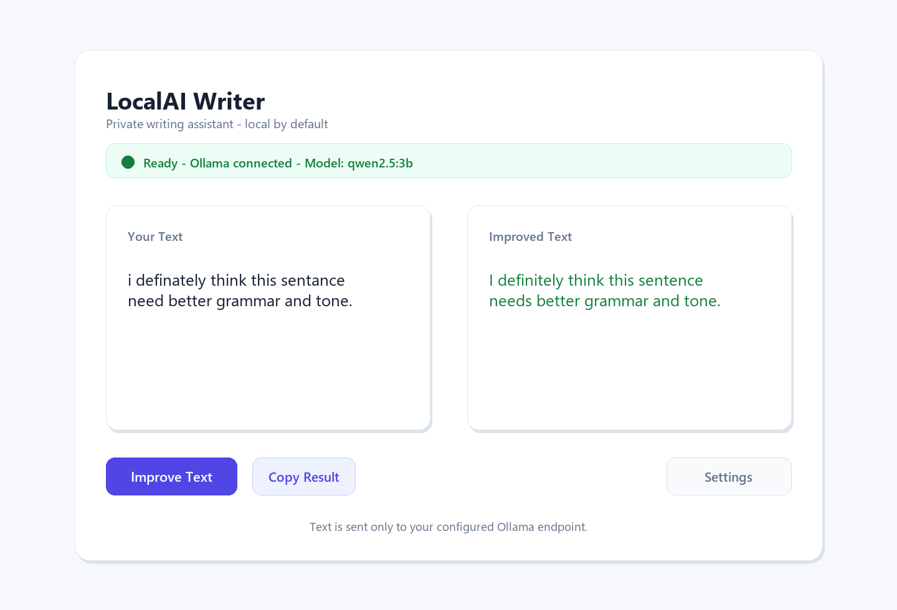
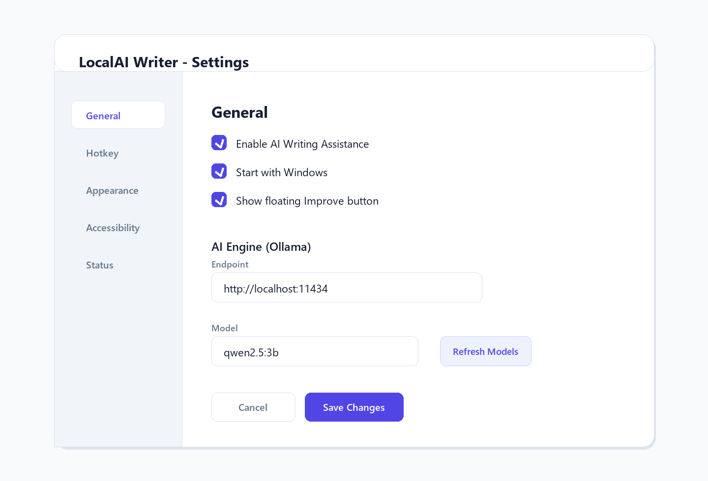
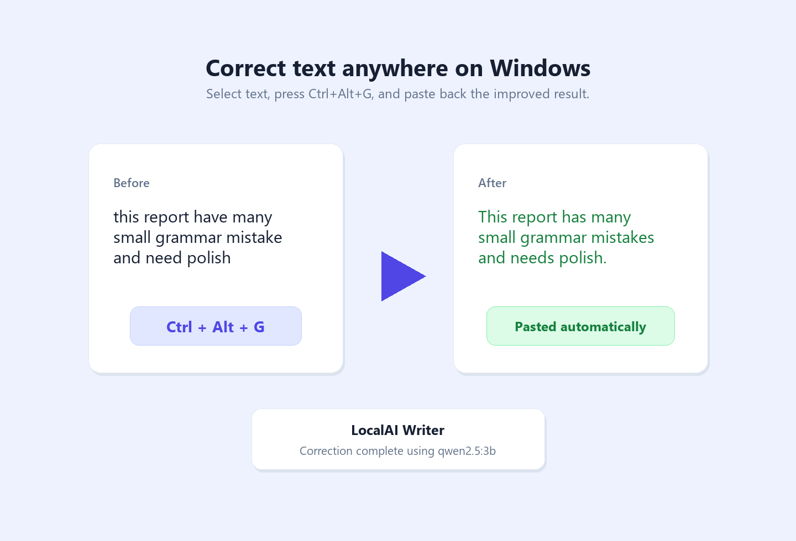

# LocalAI Writer

[](LICENSE)
[]()
[]()

**LocalAI Writer** is a privacy-first Windows writing assistant that corrects grammar, spelling, and phrasing with local LLMs through [Ollama](https://ollama.com/). Select text in any Windows app, press a hotkey, and the corrected version is pasted back automatically.

No cloud API is required. The default workflow stays on your machine.

## Screenshots

### Main Window


### Settings


### Hotkey Correction


## Features

- **Global correction hotkey:** Select text in any app and press `Ctrl+Alt+G`.
- **Local LLM support:** Uses Ollama models such as `qwen2.5:3b` or `gemma2:2b`.
- **Rule-based fallback:** Applies fast punctuation and spacing fixes when the model is unavailable.
- **Standalone editor:** Correct text directly inside the app when you do not want to use the hotkey.
- **Model and theme settings:** Configure endpoint, model, startup behavior, theme, and accessibility options.
- **System tray workflow:** Keep the assistant running quietly in the background.

## Architecture

```text
Selected text in any Windows app
        |
Global hotkey listener
        |
Clipboard capture
        |
Correction engine
   |-- Ollama local LLM
   |-- Rule-based fallback
        |
Post-processing and safety checks
        |
Paste corrected text back into active app
```

## Prerequisites

1. Windows 10 or Windows 11 x64.
2. [Ollama](https://ollama.com/) installed and running.
3. A local model, for example:

```powershell
ollama pull qwen2.5:3b
```

## Installation

### Option 1: Download Pre-built Release

Download the latest build from:

```text
https://github.com/b1nd03/LocalAIWriter/releases/latest
```

Run `LocalAIWriter.exe`, start Ollama, then choose an installed model from Settings.

### Option 2: Build from Source

```powershell
git clone https://github.com/b1nd03/LocalAIWriter.git
cd LocalAIWriter
dotnet publish src/LocalAIWriter -c Release -r win-x64 --self-contained -p:PublishSingleFile=true -o ./publish
.\publish\LocalAIWriter.exe
```

### Optional Installer

The repository includes an Inno Setup script at `installer/setup.iss`.

```powershell
dotnet publish src/LocalAIWriter -c Release -r win-x64 --self-contained -p:PublishSingleFile=true -o ./publish
iscc installer\setup.iss
```

The generated installer is written to `publish\installer\LocalAIWriter_Setup.exe`.

## How to Use

1. Start Ollama in the background.
2. Run LocalAI Writer.
3. Open Settings and choose your Ollama endpoint and model.
4. Select text in any app.
5. Press `Ctrl+Alt+G`.
6. Review the notification while the app replaces the selection with the improved text.

## Configuration

Settings are stored at:

```text
%APPDATA%\LocalAIWriter\settings.json
```

You can configure the Ollama endpoint, active model, theme, startup behavior, correction style, popup behavior, and accessibility settings.

## Documentation

- [Privacy](docs/PRIVACY.md)
- [Benchmarks](docs/BENCHMARKS.md)
- [Roadmap](ROADMAP.md)

## Development

```powershell
dotnet restore LocalAIWriter.sln
dotnet build LocalAIWriter.sln -c Release
dotnet test LocalAIWriter.sln -c Release
```

## License

This project is released under the [MIT License](LICENSE).
